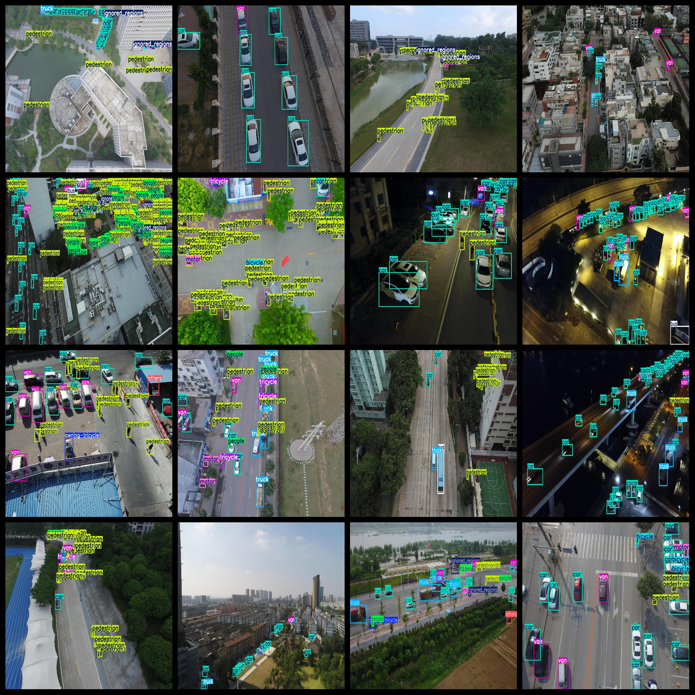
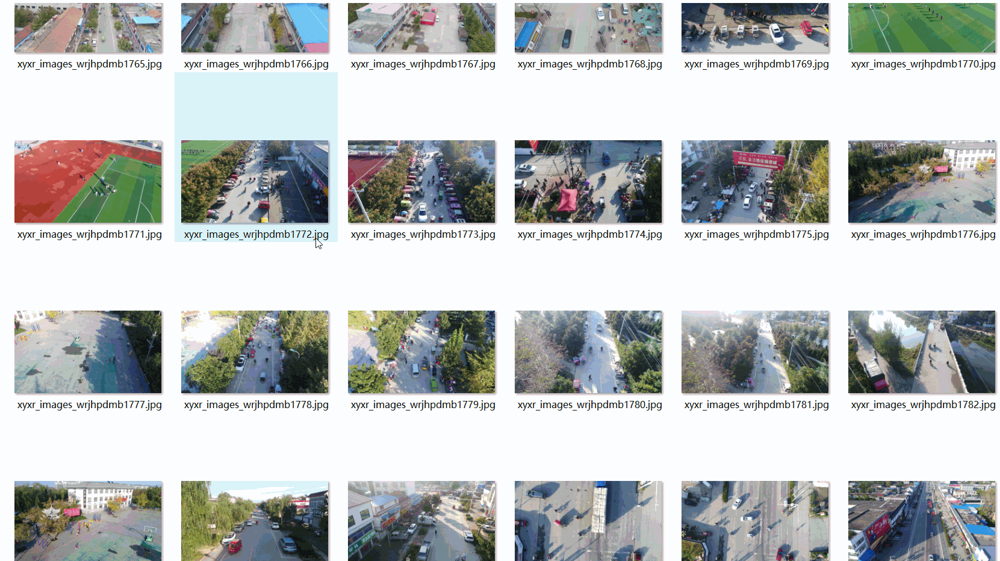

# UAV View Aerial Ground Multi-Object Detection Dataset

This dataset contains 8079 images in YOLO-VOC format, organized into three folders: JPEGImages, Annotations, and labels. The JPEGImages folder contains a total of 8079 jpg images, the Annotations folder contains 8079 xml files, and the labels folder contains 8079 txt files.

The dataset includes 12 types of labels: "awning-tricycle", "bicycle", "bus", "car", "ignored_regions", "motor", "others", "pedestrian", "people", "tricycle", "truck", "van". Each label has its corresponding number of boxes (frames) as specified in the labels folder's classes.txt file.

Here are the box numbers for each label:

- Awning-tricycle: 3844
- Bicycle: 11782
- Bus: 8866
- Car: 172916
- Ignoring regions: 10987
- Motor: 35491
- Others: 1797
- Pedestrian: 100335
- People: 33434
- Tricycle: 5342
- Truck: 15533
- Van: 30725

Total box numbers: 431052

The images are of high resolution clarity. No image enhancement is applied. The shape of the labels is rectangular boxes, which are used for target detection and recognition.

Important Notice: No guarantee is made regarding the accuracy or precision of the models trained on this dataset or any weight files. This dataset only provides accurate and reasonable annotations.

Special Note: This dataset does not guarantee any accuracy or precision of the model or weight files trained on this dataset. The dataset only provides accurate and reasonable annotations.

## Images

---

Here is a pay link on Stripe (https://buy.stripe.com/3cs8yP7sY87d0vu9AB). Please contact me lonlonago@foxmail.com after funding $89, and I will send you a complete data files, thank you!

